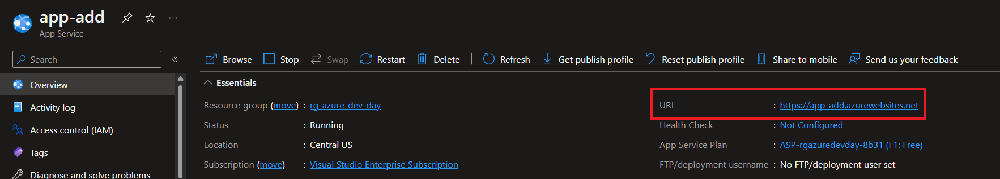

# Azure Dev Day - Web solutions lab one

**Overview**:

- [Step 1: Create a Resource Group](#step-1-create-a-resource-group)
- [Step 2: Deploy and Configure Azure SQL](#step-2-deploy-and-configure-azure-sql)
- [Step 3: Deploy and Configure App Service](#step-3-deploy-and-configure-app-service)
- [Step 4: Use Cloud Shell to Deploy the Application](#step-4-use-cloud-shell-to-deploy-the-application)
- [Part 4: Clean Up Azure Resources](#part-4-clean-up-azure-resources)

## Objectives

Hosting a Web app in App Services is a great way for developers to leverage the power of Azure cloud without the need to architect complex infrastructure and networking setup but at the same time take advantage of capabilities like security, load balancing, autoscaling, automated management and continuous deployment to name a few.

During this lab you will learn to:

- Deploy Azure Resources like Azure SQL and a Web App host in Azure App Services
- Configure the Web App to connect to the Azure SQL database
- Execute SQL code in the Portal to create a table
- Use Cloud Shell to deploy the application to the Web App
- Use the Web App to view the data and make changes to the database

**NOTE: This exercise is a section of a day-long workshop on Azure Dev Day, the complete workshop labs may be found [here](https://aka.ms/azure-dev-day-java).**

## Step 1: Create a Resource Group

1. In the Azure Portal (<https://portal.azure.com>), select **Resource Groups** from the search bar
1. Select **+ Create** and enter the following values:
    1. Basics > Resource group: rg-add-web-[uniqueid]
    1. Basics > Region: East US

## Step 2: Deploy and Configure Azure SQL

1. In the Azure Portal (<https://portal.azure.com>), select **Azure SQL** from the search bar
1. Select **+ Create**, select **SQL databases > Single database** enter the following values:
    1. Basics > Resource group: rg-add-web-[uniqueid]
    1. Basics > Database name: db
    1. Basics > Server: Create new
        1. Server name: sql-[uniqueid]
        1. Location: East US
        1. Authentication method: Use SQL authentication
        1. Server admin login: spring
        1. Password: ABCD1234abcd!
    1. Basics > Compute + storage: Configure database
        1. Service tier: Basic
    1. Basics > Backup storage redundancy: Locally-redundant backup storage
    1. Networking > Connectivity method: Public endpoint
    1. Networking > Allow Azure services: Yes
    1. Networking > Add current client IP address: Yes
1. Navigate to the new Azure SQL database
1. Select **Query Editor** from the left menu
1. Log in with the database credentials:
    1. Login: spring
    1. Password: ABCD1234abcd!
1. Apply the following script to build the correct schema:

    ```sql
    CREATE TABLE Orders
    (
        Id UNIQUEIDENTIFIER PRIMARY KEY,
        CustomerName NVARCHAR(50) NOT NULL,
        Product NVARCHAR(20) NOT NULL,
        Quantity int NOT NULL
    );
    ```

## Step 3: Deploy and Configure App Service

1. In the Azure Portal (<https://portal.azure.com>), select **App Services** from the search bar
1. Select **+ Create** and enter the following values:
    1. Basics > Resource Group: rg-add-web-[uniqueid]
    1. Basics > Name: app-add-web-[uniqueid]
    1. Basics > Runtime stack: Java 11
    1. Basics > Region: East US
    1. Basics > Sku and size: Change size
        1. Dev/Test - B1
1. Final result should look like this.

    

11. Navigate to the new App Service
12. Select **Settings > Configuration** from the left menu
13. Select **Application settings > Advanced edit** and paste in the following settings

    ```json
    {
        "name": "AZ_DB_SERVER_NAME",
        // Replace with the name of your Azure SQL Server
        "value": "sql-[uniqueid]", 
        "slotSetting": false
    },
    {
        "name": "AZ_DATABASE_NAME",
        "value": "db",
        "slotSetting": false
    },
    {
        "name": "AZ_SQL_SERVER_USERNAME",
        "value": "spring",
        "slotSetting": false
    },
    {
        "name": "AZ_SQL_SERVER_PASSWORD",
        // Replace with the password you created for the Azure SQL Server
        "value": "ABCD1234abcd!", 
        "slotSetting": false
    },
    {
        "name": "spring.datasource.url",
        "value": "jdbc:sqlserver://${AZ_DB_SERVER_NAME}.database.windows.net:1433;database=${AZ_DATABASE_NAME};encrypt=true;trustServerCertificate=false;hostNameInCertificate=*.database.windows.net;loginTimeout=30;",
        "slotSetting": false
    },
    {
        "name": "spring.datasource.username",
        "value": "${AZ_SQL_SERVER_USERNAME}",
        "slotSetting": false
    },
    {
        "name": "spring.datasource.password",
        "value": "${AZ_SQL_SERVER_PASSWORD}",
        "slotSetting": false
    }
    ```

    Final Result should look like this

    

15. Click on **OK**. Then click on **Save** and **Continue**.

## Step 4: Use Cloud Shell to Deploy the Application

1. Open Azure Cloud Shell. Click on the **Cloud Shell** icon in the top right of the portal. Then click on **Bash**. This will open a terminal window in the portal. You may need to create a storage account. If so, follow the prompts.
2. In the terminal window, run the following command to clone the repository and navigate to the project folder.

    ```bash
    git clone https://github.com/microsoft/azure-dev-day-java.git && cd azure-dev-day-java/1-web-lab
    ```

3. In the terminal window, run the following command to build the project.

    ```bash
    mvn package
    ```

4. In the terminal window, run the following command to deploy the project to the Azure App Service.

    ```bash
    az webapp deploy --resource-group rg-azure-dev-day --name app-add  --src-path target/demo.jar --type jar --async true
    ```

5. In the terminal window, run the following command to get the URL of the site. Or you can find it in the Azure portal in your App Service.

    ```bash
    az webapp show --resource-group rg-azure-dev-day --name app-add --query defaultHostName --output tsv
    ```

    or in the top right of this image you can see the URL. Navigate to your App Service in the Azure portal and click on **Overview**. Then you will see your URL.

    )  

6. Copy the URL and paste it into a new browser tab. You should see the following page.

    

## Part 4: Clean Up Azure Resources

1. In the Azure portal, Use the search bar to navigate to your resource group (**rg-azure-dev-day**).
2. Click on **Delete resource group**.
3. Click on **Delete**.
