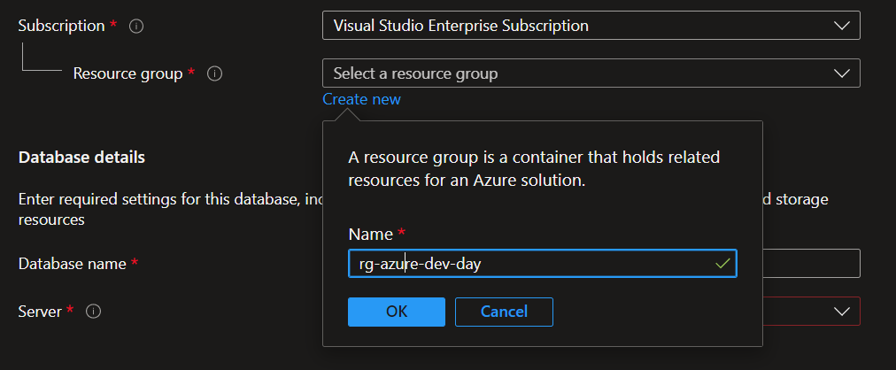
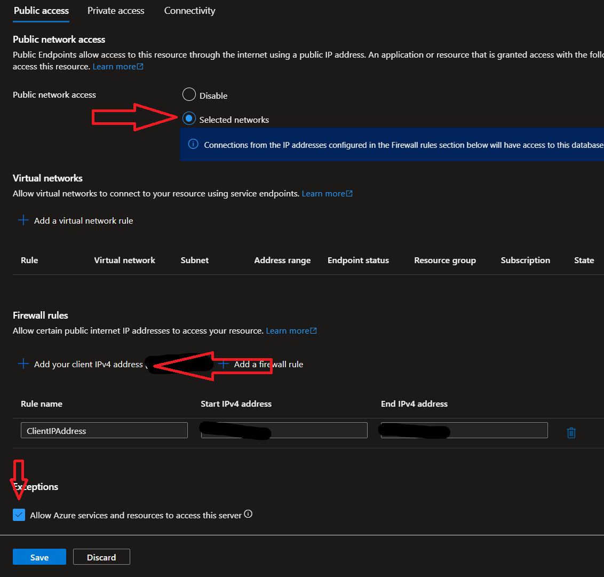
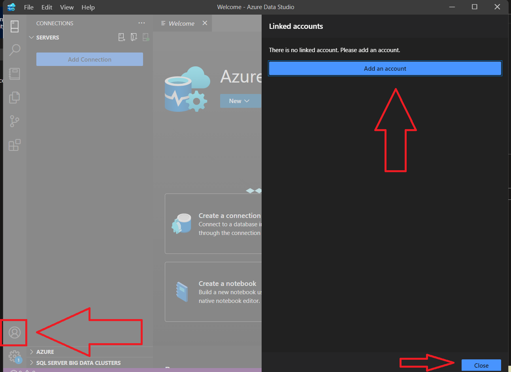

# Azure Dev Day - Web solutions lab one

**Overview**:

- [Requirements](#requirements)
- [Part 1: Deploy and Configure Azure SQL](#part-1-deploy-and-configure-azure-sql)
- [Part 2: Deploy and Configure App Service](#part-2-deploy-and-configure-app-service)
- [Part 3: Use Cloud Shell to Deploy the Application](#part-3-use-cloud-shell-to-deploy-the-application)
- [Part 4: Clean Up Azure Resources](#part-4-clean-up-azure-resources)

## Objectives

Hosting a Web app in App Services is a great way for developers to leverage the power of Azure cloud without the need to architect complex infrastructure and networking setup but at the same time take advantage of capabilities like security, load balancing, autoscaling, automated management and continuous deployment to name a few.

During this lab you will learn to:

- Deploy Azure Resources like Azure SQL and a Web App host in Azure App Services
- Configure the Web App to connect to the Azure SQL database
- Execute SQL code in the Portal to create a table
- Use Cloud Shell to deploy the application to the Web App
- Use the Web App to view the data and make changes to the database

**NOTE: This exercise is a section of a day-long workshop on Azure Dev Day, the complete workshop labs may be found [here](https://aka.ms/azure-dev-day-java).**

## Requirements

We encourage you to follow along the hands-on labs during lab sessions.

- If you don't have an Azure Subscription to use for these labs, please create a free subscription at <https://azure.microsoft.com/free/>.

## Part 1: Deploy and Configure Azure SQL

1. Login to the azure portal at <https://portal.azure.com>
2. Search for thew resource called **Azure SQL** and create a new instance of it.

    
    

3. Create a new resource group called **rg-azure-dev-day**.

    

4. Create a new Azure SQL Server. The name needs to be qunique across Azure, so you can use your initials or something similar. For example, if your name is John Doe, you can use **jdoe-sql**.
5. Use SQL Authentication and create a new user called **spring** with a password of your choice. Make sure to save the username and password as you will need it later.

    

6. Create a new database called **db**.

    

7. Once the database and server are created, click on go to resource.
8. You will see a **Getting Started** page. Click on **Configure** under the Configure access section.

    

9. Under Public network access, select the radio button for **Selected networks**.
10. Under Firewall rules, click on **+ Add your client IPv4 address**.
11. Scroll down to the bottom of the page. Under Exception check the box for **Allow Azure services and resources to access this server**.

    

12. Click on **Save**.
13. On the left hand side of the page select **SQL databases**. Then click on your database **db**.
14. Add a new table to the database. Option A: Use Query Editor.Option B: Use Azure Data Studio.
    - Option A:  **Query editor (preview)**.
        - Use the username and password you created earlier to login.

          

        - Click on **New Query**.

            

        - Copy and paste the following code into the query window.

            ```sql
            CREATE TABLE Orders
            (
                Id UNIQUEIDENTIFIER PRIMARY KEY,
                CustomerName NVARCHAR(50) NOT NULL,
                Product NVARCHAR(20) NOT NULL,
                Quantity int NOT NULL
            );
            ```

        - Click on **Run**.
    - Option B: **Azure Data Studio**.
        - Download and install [Azure Data Studio](https://docs.microsoft.com/en-us/sql/azure-data-studio/download-azure-data-studio?view=sql-server-ver15).
        - Open Azure Data Studio.
        - Click on **Accounts** icon in the bottom left.
            
            

        - Click on **Add Account**. Follow the prompts to login to your Azure account. Then close screen Linked Accounts pane.
        - Click on **Connections** icon in the top left.
        - Click on **New Connection**.
        - At the top right switch the tab from **Recent** to **Browse**.

            

        - Select Azure and completed the prompts to connect to your Azure SQL database.
        - The information at the bottom of the screen will fill itself in, you just need to switch the authentication type to **SQL Login** and enter the username and password you created earlier.
        - Enter the server name, username and password you created earlier.
        - Click on **Connect**.
        - Click on **New Query**.
        - Copy and paste the following code into the query window.

            ```sql
            CREATE TABLE Orders
            (
                Id UNIQUEIDENTIFIER PRIMARY KEY,
                CustomerName NVARCHAR(50) NOT NULL,
                Product NVARCHAR(20) NOT NULL,
                Quantity int NOT NULL
            );
            ```

        - Click on **Run**.

## Part 2: Deploy and Configure App Service

1. Now with the table created, we can move on to the next step. This step will create a new Web App in Azure App Services. This will be the host for our application. Use the search bar at the top of the page to search for **App Services**. Then click on **App Services**.
2. Click on **Create**.
3. Use the same resource group you created earlier (**rg-azure-dev-day**).
4. Name the app a unique name. For example, if your name is John Doe, you can use **jdoe-app**.
5. Select **Java 11** for the runtime stack.
6. Select **Linux** for the operating system.
7. Select **Java SE** for the Java version.
8. Use the same region as your Azure SQL database.
9. Change the SKU and size to **F1**. This can be found under the Dev/Test section.

    

10. Final result should look like this.

    

11. Click on **Review + create**. Then click on **Create**.
12. Once the app is created, click on **Go to resource**.
13. Configure the app to connect to the Azure SQL database. Click on **Configuration**.
14. Click on **Advanced edit**. Then paste the following code into the middle of the square brackets.

    ```json
    {
        "name": "AZ_DB_SERVER_NAME",
        // Replace with the name of your Azure SQL Server
        "value": "add-dbserver", 
        "slotSetting": false
    },
    {
        "name": "AZ_DATABASE_NAME",
        "value": "db",
        "slotSetting": false
    },
    {
        "name": "AZ_SQL_SERVER_USERNAME",
        "value": "spring",
        "slotSetting": false
    },
    {
        "name": "AZ_SQL_SERVER_PASSWORD",
        // Replace with the password you created for the Azure SQL Server
        "value": "y2$*D7DBdxq5", 
        "slotSetting": false
    },
    {
        "name": "spring.datasource.url",
        "value": "jdbc:sqlserver://${AZ_DB_SERVER_NAME}.database.windows.net:1433;database=${AZ_DATABASE_NAME};encrypt=true;trustServerCertificate=false;hostNameInCertificate=*.database.windows.net;loginTimeout=30;",
        "slotSetting": false
    },
    {
        "name": "spring.datasource.username",
        "value": "${AZ_SQL_SERVER_USERNAME}",
        "slotSetting": false
    },
    {
        "name": "spring.datasource.password",
        "value": "${AZ_SQL_SERVER_PASSWORD}",
        "slotSetting": false
    }
    ```

    Final Result should look like this

    

15. Click on **OK**. Then click on **Save** and **Continue**.

## Part 3: Use Cloud Shell to Deploy the Application

1. Open Azure Cloud Shell. Click on the **Cloud Shell** icon in the top right of the portal. Then click on **Bash**. This will open a terminal window in the portal. You may need to create a storage account. If so, follow the prompts.
2. In the terminal window, run the following command to clone the repository and navigate to the project folder.

    ```bash
    git clone https://github.com/microsoft/azure-dev-day-java.git && cd azure-dev-day-java/1-web-lab
    ```

3. In the terminal window, run the following command to build the project.

    ```bash
    mvn package
    ```

4. In the terminal window, run the following command to deploy the project to the Azure App Service.

    ```bash
    az webapp deploy --resource-group rg-azure-dev-day --name app-add  --src-path target/demo.jar --type jar --async true
    ```

5. In the terminal window, run the following command to get the URL of the site. Or you can find it in the Azure portal in your App Service.

    ```bash
    az webapp show --resource-group rg-azure-dev-day --name app-add --query defaultHostName --output tsv
    ```

    or in the top right of this image you can see the URL. Navigate to your App Service in the Azure portal and click on **Overview**. Then you will see your URL.

    )  

6. Copy the URL and paste it into a new browser tab. You should see the following page.

    

## Part 4: Clean Up Azure Resources

1. In the Azure portal, click on **Resource groups**.
2. Click on **rg-azure-dev-day**.
3. Click on **Delete resource group**.
4. Click on **Delete**.
