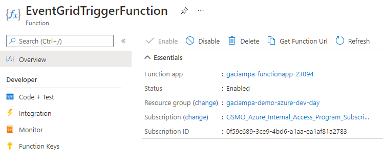
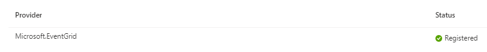
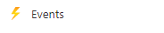
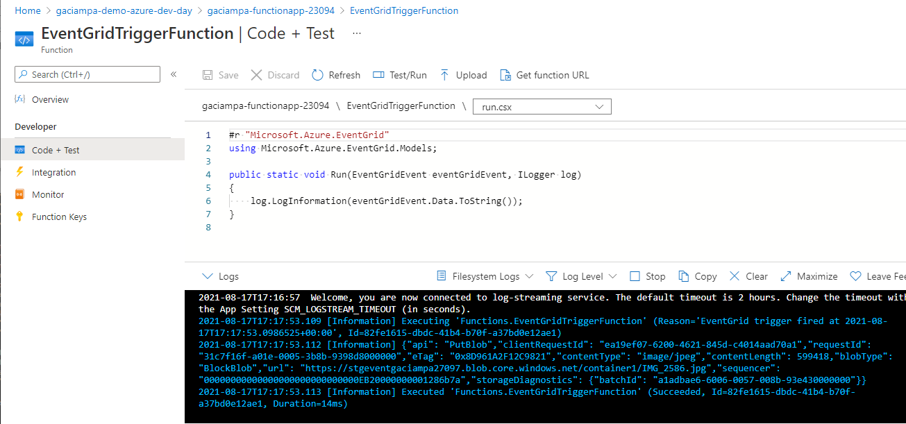
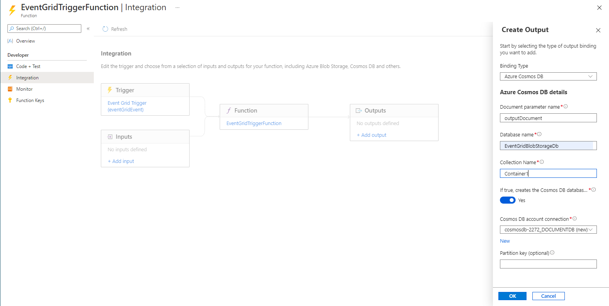
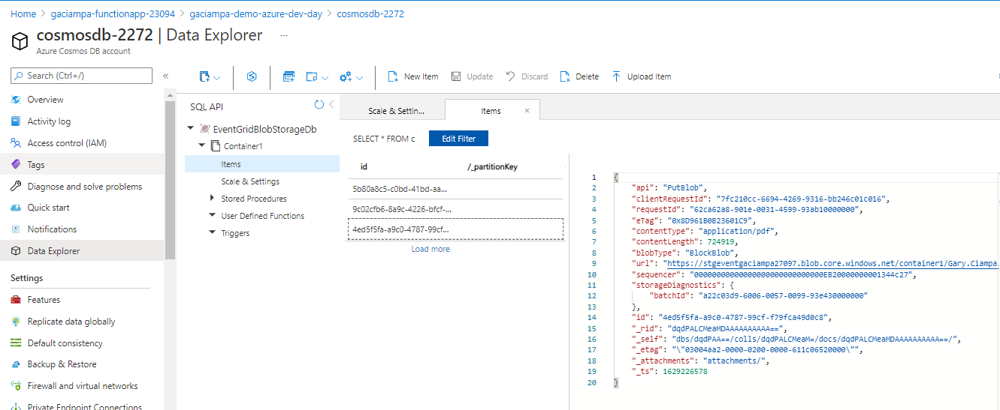
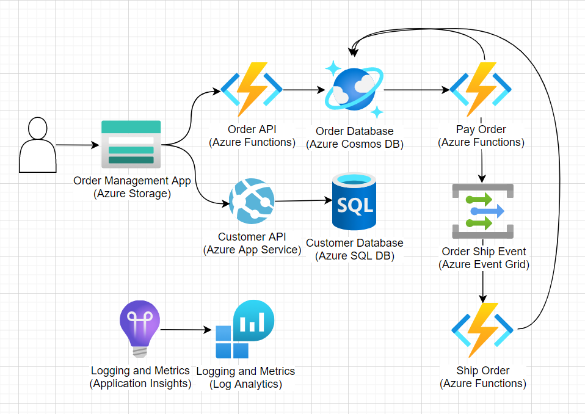

# Azure Dev Day - Serverless Lab

<!-- TOC -->
- [Requirements](#requirements)
- [Step 1: Setup Azure subscription and properties](#step-1-setup-azure-subscription-and-properties)
- [Step 2: Create an Azure Resource Group ](#step-2-create-an-azure-resource-group)
- [Step 3: Create Cosmos DB resources](#step-3-create-cosmos-db-resources)
- [Step 4: Create Function App](#step-4-create-function-app)
- [Step 5: Create Event Grid](#step-5-create-event-grid)
- [Step 6: Event Grid Blob Storage Test](#step-6-event-grid-blob-storage-test)
- [Step 7: Azure Cosmos DB Output Binding](#step-7-azure-cosmos-db-output-binding)
- [Step 8: Clean up resources](#step-8-clean-up-resources)
- [Bonus Material Order Management Orchestration](#bonus-material-order-management-orchestration)
- [Bonus Material Keda Scaling](#bonus-material-keda-scaling)

<!-- TOC -->

## Objectives

Azure Event Driven and Serverless offerings provide a wide array of capabilities to drive modern solution architecture. This lab demonstrates the following Azure services:

- Azure Event Grid
- Azure Function Apps
- Azure Cosmos DB

## Requirements

This example assumes the user already has an Azure subscription with contributor access. Additionally, the following services will be required during the lab:

--To Do--

## Step 3: Create Cosmos DB resources

1. Log into the azure portal (https://portal.azure.com).
1. Select **Azure Cosmos DB** from the search bar results and select **+ Create**.
1. Select **Azure Cosmos DB for NoSQL**
1. Enter the following values:
    1. Basics > Resource Group > Create new: rg-add-serverless-[uniqueid]
    1. Basics > Account Name: cosmos-add-serverless-[uniqueid]
    1. Basics > Location: East US
1. Navigate to the deployed Cosmos DB account.
1. Select **Data Explorer** from the left menu.
1. Select **New Container** and enter the following values:
    1. Database id: AzureDevDay
    1. Container id: Uploads
    1. Partition key: /id
1. Select **Settings > Keys** from the left menu and copy the **Primary Connection String** for use later.

## Step 1: Deploy the Azure Function App

1. Log into the azure portal (https://portal.azure.com).
1. Select **Function App** from the search bar results and select **+ Create**.
1. Enter the following values:
    1. Basics > Resource Group: rg-add-serverless-[uniqueid]
    1. Basics > Name: func-add-serverless-[uniqueid]
    1. Basics > Runtime stack: Java
    1. Basics > Version: 11
    1. Basics > Region: East US
    1. Hosting > Storage account > Create new: staddsless[uniqueid]
1. Navigate to the deployed Function App.
1. Select **Settings > Configuration** and add the following **Application Setting**:
    1. Name: CosmosConnectionString
    1. Value: [Primary connection string from above]

## Step 3: Deploy the Function App

1. Open the **2-serverless-lab** folder in a terminal with the Azure CLI.
1. Ensure the Azure CLI is pointing to the right subscription by running

   ```bash
   az account show
   ```

1. Upload the deployment package with the following command:

    ```bash
    az functionapp deployment source config-zip -g rg-add-serverless[uniqueid] -n func-add-serverless-[uniqueid] --src deploy-package.zip
    ```

## Step 5: Create the Event Grid Topic and Subscription

1. Log into the azure portal (https://portal.azure.com).
1. Select **Event Grid System Topics** from the search bar results and select **+ Create**
1. Enter the following values:
    1. Basics > Resource group: rg-add-serverless-[uniqueid]
    1. Basics > Name: eg-add-serverless-blob
    1. Basics > Region: East US

### Step 5.a: Create Storage Account for Event Grid, Azure Fuction and Event Grid

````shell 
# Create storage account for Event Grid Service 
az storage account create --name $STORAGE_ACCOUNT_EVENT --location $REGION --resource-group $RESOURCE_GROUP --sku Standard_LRS --tags $TAG_PREFIX=$TAG_VALUE  
````

**NOTE: Switch to the Azure Portal for the remaining steps in the execise as indicated.** 

### Step 5.b Create a Function to receive Event Grid events 

Navigate to the Resource Group created previously, select the Function App, and create a new Function. 

- Development Environment: **Develop in portal**
- Template: **Azure Event Grid trigger** 
- Template details, New Function: **EventGridTriggerFunction** 
- Create

Navigate within the function app, verify function is **Enabled** 

 

### Step 5.c: Ensure the Azure subscription has **Registered** the *Microsoft.EventGrid resource provider* 

- Navigate in the Azure portal to the **Subscription**
- Select the **Settings->Resource providers**
- Filter on **EventGrid** 
- **Verify** or **Check**: **Status=Registered**



##
### Step 5.d: Create Event Grid System Topic and Function to process blob storage events 

Navigate to the Resource Group created previously, select the **Event Grid Storage Account**, **Events**  icon and **Create** an **Event Subscription**, link it to the Function App. 

- Configure and verify the **Topic Type** and **Source Resource** match the **stgevent....** resource created previously 
- Select:  **Event Subscription** 
- Name: **BlobEventGridToFunctionApp** 
- Event Schema: **Event Grid Schema** 
- System Topic Name: **BlobEventGridToFunctionAppTopic**
- Event Types Filter: **default 2 selected, or as desired** 
- Endpoint Type: **Azure Function** 
- Endpoint: **select endpoint** (navigate and select the desired FunctionApp and select the default **Function Name**  
- **Create**, a Function will **automatically** be created to process the **Event Grid** trigger

 

Navigate to the Resource Group created previously, select the **Function App** -> **Functions** -> Select the **Function Name** -> **Code and + Test**: . 

- Verify **{EventGridTriggerFunction}\run.csx** contains the following properties: 

````shell
#r "Microsoft.Azure.EventGrid"
using Microsoft.Azure.EventGrid.Models;

public static void Run(EventGridEvent eventGridEvent, ILogger log)
{
    log.LogInformation(eventGridEvent.Data.ToString());
}
````


## Step 6: Event Grid Blob Storage Test

Current status is the following have been created and ready for testing: 

- Azure Blob storage account 
- Event Grid Topic for stoage account changes  
- Function App to receive and log events 

Next step is to create an blob container, upload files and verify the Event Grid System Topic triggers the Function App 

- Navigate to the Resource Group, select the storage account crated for the **Event Grid**
- Select: **Containers**, **+ Add Container**
- Name: **container1**, 
- Access level: **default** or **as desired** 
- Create 

Open a second browser session in the Azure Portal:
- Session 1: Navigate to the newly created **Blob container1**
- Session 2: Navigate to the Function App, **EventGridTriggerFunction**, and open the **Logs** menu, to view the Function logs 
- **Blob container**, select **Upload**, upload a favorite file, image or related media:

 

-  **EventGridTriggerFunction**, observe for each image, Event Grid will trigger the Fuction, **Logs** will reflect the Event Grid trigger content: 

 


## Step 7: Azure Cosmos DB Output Binding

The next step in the application architecture is to push a document representing the Event Grid event to **Cosmos DB** for subsequent downstream processing. Adding Cosmos DB requires two steps: 

- Adding an **Output Binding** to the **EventGridTriggerFunction**
- Updating the  **EventGridTriggerFunction** function to emit the events into Cosmos DB 

### Step 7.a: Azure Cosmos DB Output Binding

Navigate to the **EventGridTriggerFunction**, select **Integration** and **Add output**: 
- Binding Type: **Azure Cosmos DB**, select **New**, **Cosmos DB account connection**, and link to Cosmos DB account created earlier in the resource group
- Document parameter name: **outputDocument** (case sensitive and must match the outputDocument property in the function 
- Database name: **EventGridBlobStorageDb** (as desired)
- Colleciton name: **Container1** (as desired) 
- If true, ..: **Yes** 
- Cosmos DB account connection: **select Cosmos DB account created earlier**  


 

## 

### Step 7.b: Update Azure Function to emit document event to CosmosDB binding

**EventGridTriggerFunction\run.csx** with **outputDocument** set to emit to Cosmos DB output binding: 

````shell
#r "Microsoft.Azure.EventGrid"
using Microsoft.Azure.EventGrid.Models;


[FunctionName("EventGridTrigger1")]
public static void Run(EventGridEvent eventGridEvent,  out  object outputDocument, ILogger log)
{
    log.LogInformation(eventGridEvent.Data.ToString());
    outputDocument = eventGridEvent.Data; 

}

````

### Step 7.c: Azure Cosmos DB Output Binding Test 

The next step is repeat of [Step 6](#step-6-event-grid-blob-storage-test) with an additional verification. Set up browsers as described previously, and upload a desired file into the **container 1**: 

- Verify the **EventGridTriggerFunction** triggers successfully via the **Logs** 
- Navigate to the Cosmos DB **Data Explorer**, select the **EventGridBlobStorageDb**, **Items** document
- Verify the corresponding event id from the event grid trigger function matches and successive changes to the blob storage trigger updates to items in the Cosmos DB

 

The previous example demonstrates the relationship and services to connect Azure Event Grid to Azure Functions and then persist data in Azure Cosmos DB for an example of an event-driven architecture using **Azure Serverless offerings** 


## Step 8: Clean up resources 

Do NOT forget to remove the resources once you've completed the exercise, [Azure Group Delete](https://docs.microsoft.com/en-us/cli/azure/group?view=azure-cli-latest#az_group_delete)

```shell
 az group delete --name $RESOURCE_GROUP --yes
```

## Bonus Material Order Management Orchestration 

This workshop walks through hosting an Azure-hosted solution utlizing Azure PaaS offerings and is geared toward Java developers. Find the [Bonus Material here](https://github.com/joelwaymack/order-management-java).



## Bonus Material Keda Scaling 

Want to accelerate and test your understanding of the various tools, integrate Azure Functions, Azure Kubernetes by adding KEDA auto-scaling. Find the [Bonus Material here](https://github.com/garyciampa/azure-dev-day-serverless/blob/main/BonusMaterial/readme.md)
